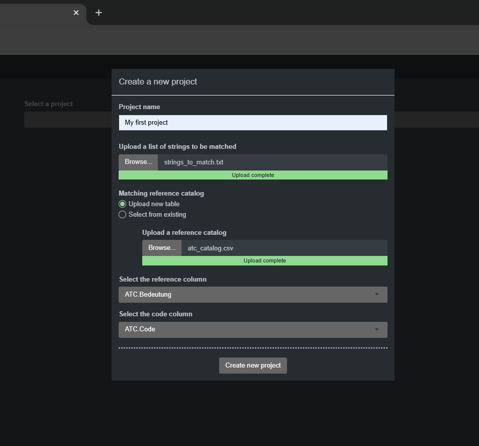
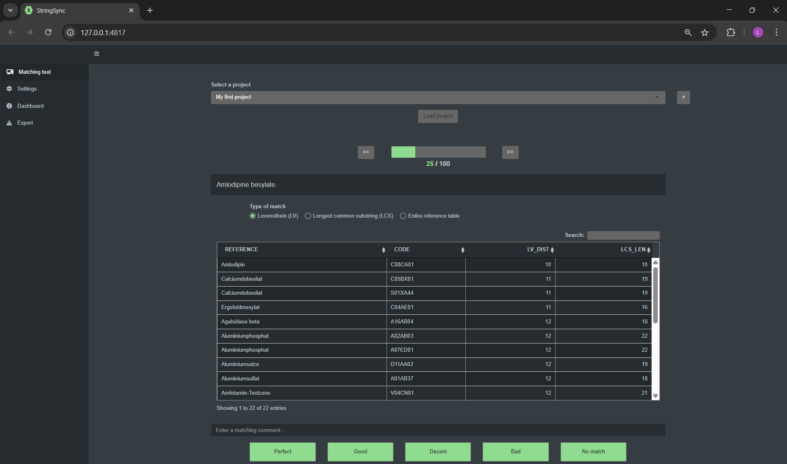

# stringSync
R-Shiny based tool for matching strings to a reference catalog

# Basic use
StringSync categorizes work tasks into projects. A project is defined as one list of strings and a reference catalog.
To create a project, click the "+" button. Then load the project to start working on it.

# Creating a project
Click the "+" button to open the project setup dialog. Upload your list of strings as a plain text file with one string per line.
For the reference table, either upload a new .csv file or choose an existing one.
Then, select the reference column, which contains the strings to match against your list, and the code column, which holds the codes or IDs for those entries.

# Loading a project & workflow
Once you've created a project, you can load it to begin working.
The image below shows the UI after a project is loaded.

For each string, the matching workflow proceeds from top to bottom:
At the top, a progress bar shows how many strings have been matched. You can navigate between strings using the `<<` and `>>` buttons.  
The current string appears next, followed by the selected string-comparison method:
- **Levenshtein distance**: Measures the number of single-character edits needed to match the string.  
- **Longest common substring**: Finds the longest shared sequence between the string and potential matches.  
- **Entire reference catalog**: Displays the entire reference catalog for manual candidate search. 
Matching candidates appear in a table. The user selects the most likely match(es) and rates them using one of five buttons at the bottom.

# Settings
The number of matches shown in the table is configurable. However, the actual number of rows may vary, as all matches with the same distance are included. For example, if the limit is set to 2, all matches with the two lowest distances will be shown—even if that includes multiple entries per distance.

# Dashboard
Here you can view the distribution of match qualities of your selected project.

# Export
Select a project and download your matching data in tabular form.
The export is a csv with one row for each string in your string list.
The csv contains the following columns
- **STRINGS_TO_MATCH**: The list of strings.
- **REFERENCE**: The match(es) from your reference catalog.
- **LV_DIST**: Levenshtein distance of the match.
- **LCS_LEN**: Longest common substring metric of the match.
- **CODE**: Reference code from your reference catalog.
- **MATCH_QUALITY**: The selected match quality (1=Perfect, 5=No match).
- **COMMENT**: If provided, a column for the matching.
